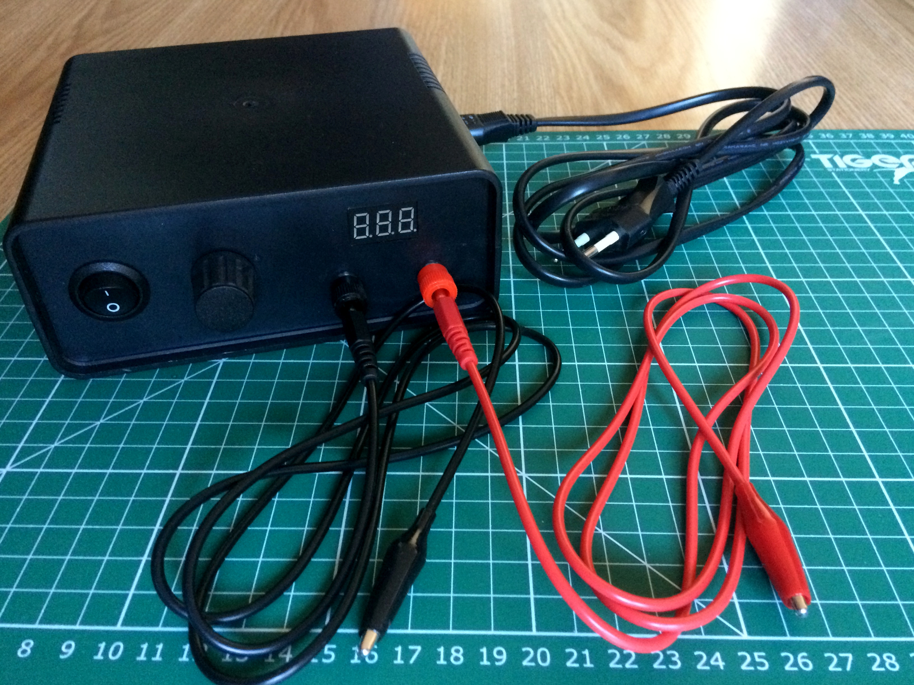

## Converting the voltage

As the laptop adapter provides a fixed amount of output voltage (19 VDC in this case), you will need some device that “does the magic” of reducing the DC voltage to lower levels. The best option for this purpose is an DC-to-DC voltage reduction module that includes the LM2596 DC-to-DC step-down converter. It costs about £2 and supports an input voltage of up to 35 VDC and 3 A. This module comes with a tiny 10 kΩ potentiometer for regulating the output voltage, which can vary between 1.25 VDC and 35 VDC (19 VDC in this case, due to the laptop adapter limitation).

