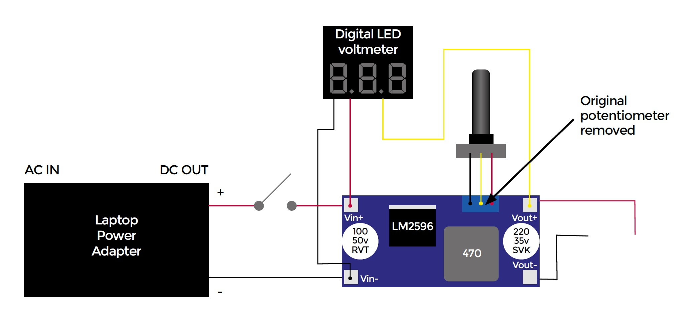

## Assembly

You should first carefully desolder the tiny potentiometer and then solder back a regular 10 kΩ potentiometer, which can be handled easily from the exterior of the power supply enclosure.

After removing the plastic case of the laptop power adapter, solder its output wires to the input of the DC-to-DC voltage reduction module through a switch, so that the power supply can be turned on and off.

A digital LED voltmeter (again something that you can get for £1–£2) is connected to the DC-to-DC voltage reduction module and shows the selected output voltage to the user. The voltmeter used in this project is able to provide a readout of voltages from 2.5 to 30 VDC with 1% accuracy.

Now it’s necessary to fit everything into an appropriate enclosure to have all the components safely connected, and to be able to transport the power supply wherever you fancy. The DC-to-DC module can just hang from the wires to which it’s soldered, but be careful to isolate it properly if you use a metallic enclosure. To fix the laptop adapter to the enclosure, a good idea is to cut a piece of its original plastic case (they will have the same size and thus fit tightly) and use it as a bracket, glueing it to the enclosure.

