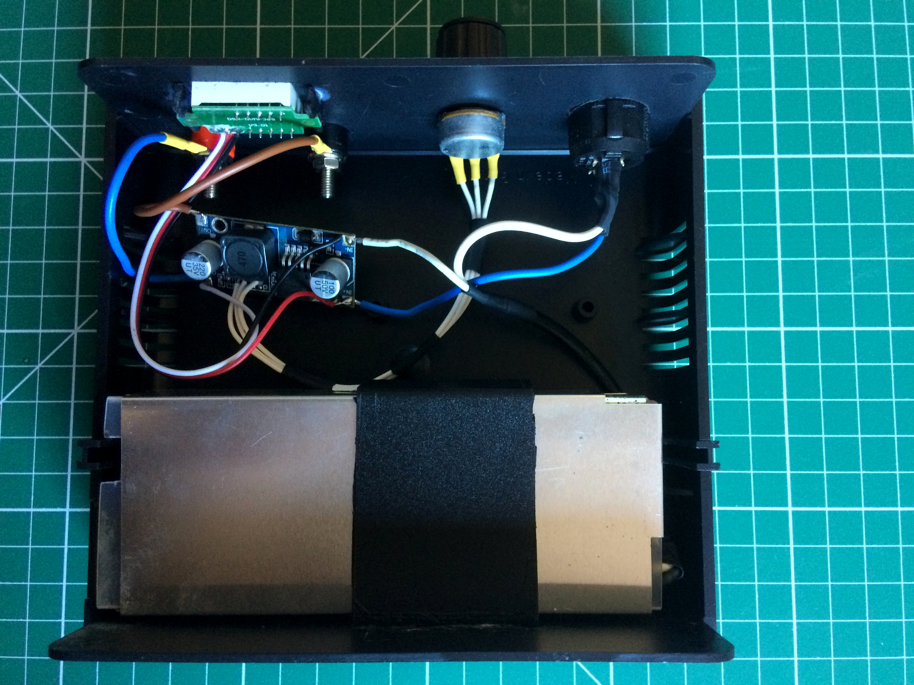

## The front panel

The final step is to install all the external elements on the front panel: switch, potentiometer, digital LED voltmeter, and banana plugs (to provide the output voltage to the banana cables), as well as the laptop adapter 220 VAC input on the back or on one side of the case. As a finishing touch you can add a potentiometer knob cap, so it’s easier to turn it to select the desired output voltage, and why not, it looks much nicer! 

Be careful when handling the DC-to-DC voltage reduction module while it’s functioning, as some of its components (especially the DC-to-DC step-down converter) may become very hot. Make sure that it stays cool enough not to damage your enclosure, and that there’s nothing that could catch fire.

